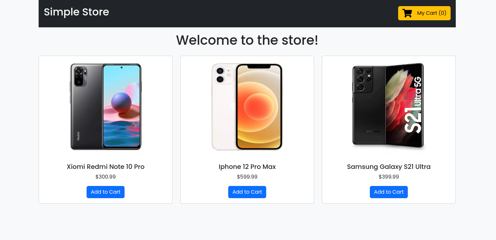
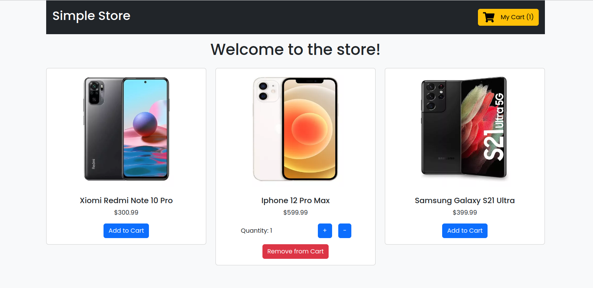
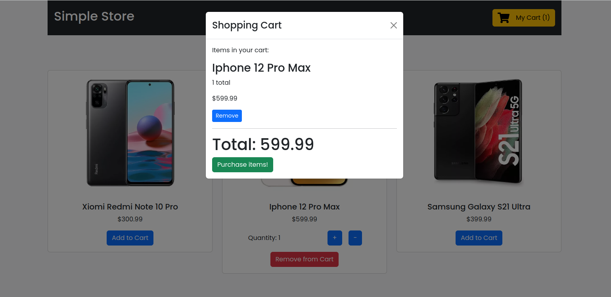
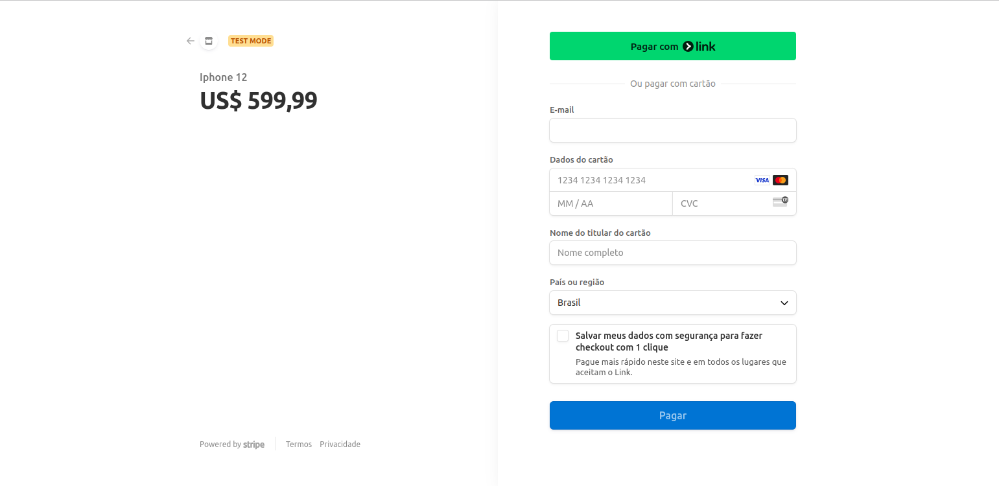

<div>

# Online Store

## Visão Geral

Este projeto é uma aplicação de loja online que utiliza TypeScript, Node.js, React, MySQL com Sequelize, Stripe para pagamentos e Docker para containerização. A aplicação é composta por um backend que gerencia a lógica de negócios e a comunicação com o banco de dados, e um frontend que oferece uma interface de usuário interativa.

## Tecnologias Utilizadas

- TypeScript: Usado tanto no frontend quanto no backend para proporcionar um desenvolvimento mais seguro e eficiente.

- Node.js: Plataforma para construir o backend da aplicação.

- Express.js: Framework para Node.js utilizado para criar a API RESTful.

- React: Biblioteca JavaScript para construir a interface do usuário no frontend.

- MySQL: Banco de dados relacional usado para armazenar os dados da aplicação.

- Sequelize: ORM (Object-Relational Mapping) para interagir com o banco de dados MySQL de maneira mais fácil.

- Stripe: Plataforma de pagamento online integrada para gerenciar transações.

- Docker: Ferramenta de containerização para garantir que a aplicação seja executada de forma consistente em diferentes ambientes.

## Pré-requisitos

Antes de começar, você precisará ter os seguintes requisitos:

- Docker

- Node.js

- MySQL

- Uma conta na plataforma de pagamentos Stripe

## Como Executar a Aplicação
### Configuração do Banco de Dados

1. Crie um banco de dados MySQL para a aplicação.
2. Configure as variáveis de ambiente para conectar ao banco de dados no arquivo .env no diretório backend.

Exemplo do arquivo .env:
```
DB_HOST=localhost
DB_USER=root
DB_PASSWORD=yourpassword
DB_NAME=onlinestore
STRIPE_SECRET_KEY=your_stripe_secret_key
STRIPE_WEBHOOK_SECRET=your_stripe_webhook_secret
```
## Construindo e executando o backend e banco de dados com Docker
1. Navegue até o diretório raiz do backend.
2. Execute o comando abaixo para construir e iniciar os contêineres Docker:
```
docker compose up -d --build
```

3. Frontend:

- Navegue até o diretório frontend.
- Instale as dependências:
```
npm install
```

- Inicie o servidor de desenvolvimento:
```
npm start
```

## Executando Localmente
Se preferir executar localmente sem Docker, siga os passos abaixo:

### 1. Backend:

- Navegue até o diretório backend.

- Instale as dependências:
```
npm install
```

- Inicie o servidor:
```
npm start
```

O servidor backend estará disponível em **http://localhost:3001.**

### 2. Frontend:

- Navegue até o diretório frontend.
- Instale as dependências:
```
npm install
```

- Inicie o servidor de desenvolvimento:
```
npm start
```

## Funcionalidades Principais

### Backend
- Autenticação: Rotas para login, registro, recuperação de senha.
- Gerenciamento de Usuários: CRUD completo para usuários.
- Produtos: CRUD completo para produtos.
- Pedidos: Criação e visualização de pedidos.
- Pagamentos: Integração com Stripe para gerenciar pagamentos.

### Frontend
- Home Page: Listagem de produtos disponíveis.
- Página de Produto: Visualização detalhada de cada produto.
- Carrinho de Compras: Adicionar, remover e atualizar itens no carrinho.
- Checkout: Processo de pagamento utilizando Stripe.
- Perfil do Usuário: Visualização e atualização de informações do usuário e histórico de pedidos.

## Simulando Pagamento
### Cartões para simulação
1. Pagamento concluído
```
4242 4242 4242 4242
```

2. Pagamento precisa de autenticação
```
4000 0025 0000 3155
```

3. Pagamento recusado
```
4000 0000 0000 9995
```
## ScreenShots

<br />



<br />



<br />



<br />


